---

<div align="center">

###  Building intelligence at the edge — where hardware meets AI

[](https://github.com/Pranshmish)
[](https://www.linkedin.com/in/pranshul-mishra-1b3ba5329/)
[](https://synapsense.site)
[](mailto:pranshulmish@gmail.com)

</div>

---

####  About Me

```yaml
name: Pranshul Mishra
location: Gorakhpur, India
education: MMMUT (B.Tech) · Research Intern @ NIT Patna
role: Founder @ SynapSense
focus: Fullstack Developer · AI Agents · Agentic System · Edge AI
currently_building: Decentralized Edge AI systems
open_to: Collaboration · Research · Open Source
```

---

####  Tech Stack

<div align="center">


</div>

---

####  GitHub Stats

<div align="center">
  
  
</div>

<div align="center">
  
</div>

---

<div align="center">


**`> building the future at the edge_`**

</div>
