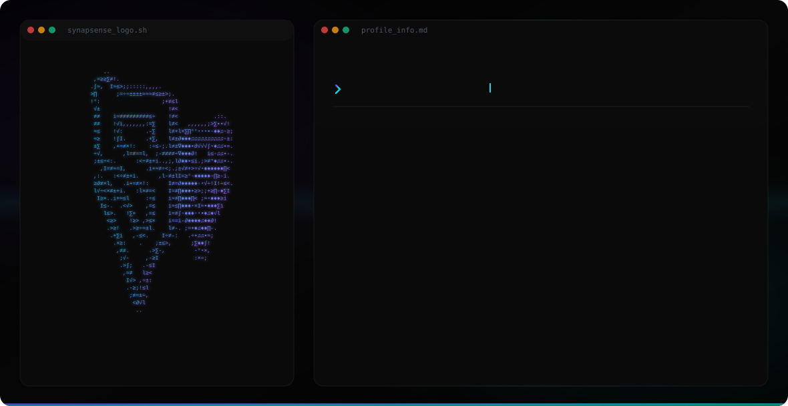

---

<div align="center">

###  Building intelligence at the edge — where hardware meets AI

[](https://github.com/Pranshmish)
[](https://www.linkedin.com/in/pranshul-mishra-1b3ba5329/)
[](https://synapsense.site)
[](mailto:pranshulmish@gmail.com)

</div>

---

####  About Me

```yaml
name: Pranshul Mishra
location: Gorakhpur, India
education: MMMUT (B.Tech) · Research Intern @ NIT Patna
headline: Embedded Systems & TinyML Researcher | Bare-Metal C/C++ | Microcontroller SLM Runtimes
focus: Bare-Metal C/C++ · FreeRTOS · TinyML Inference · Microcontroller SLMs · Edge Robotics (ROS 2)
currently_building: On-device SLM runtimes & decentralized edge intelligence
open_to: Global Research Internships · Edge AI / Robotics Labs · Open Source Systems
```

---

####  Technical Arsenal

<div align="center">

<!-- Low-Level & Languages -->


<!-- Embedded & Hardware -->


<!-- Edge AI & TinyML -->


<!-- Robotics & Systems -->


</div>

---

####  GitHub Stats

<div align="center">
  
  
</div>

<div align="center">
  
</div>

---

<div align="center">


**`> building the future at the edge_`**

</div>
